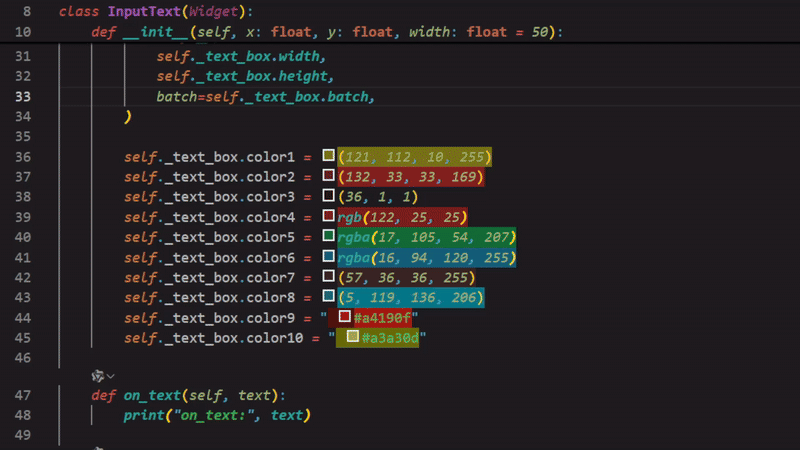
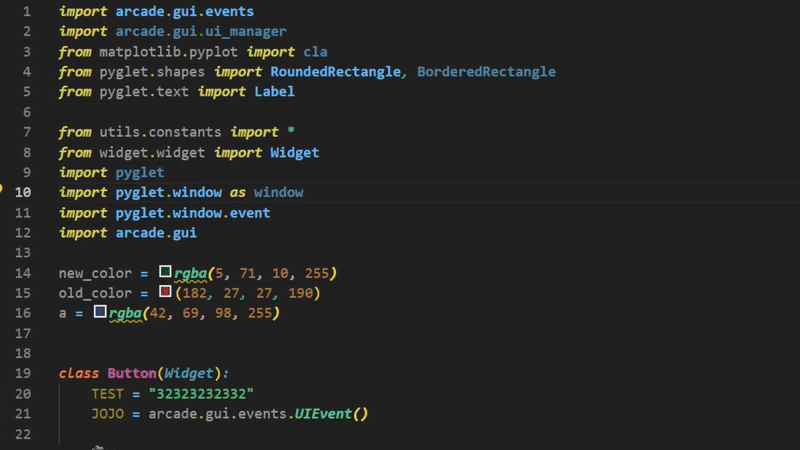

# PyCodeJOJO

> **最新版本：v2025.5.10**  
> **更新亮点：新增随机主题功能，优化颜色选择器体验**

一个简洁实用的 VS Code Python 开发扩展，提供代码诊断、颜色选择器、属性生成器等辅助功能，帮助提升 Python 开发体验。

A simple and practical VS Code Python development extension that provides code diagnostics, color picker, property generator and other helpful features to enhance your Python development experience.

---

## ✨ 主要特性 / Main Features

### 🎨 智能颜色选择器 / Smart Color Picker

- 支持多种颜色格式：`rgb()`, `rgba()`, `#hex`, `(r,g,b)`, `(r,g,b,a)`
- Support multiple color formats: `rgb()`, `rgba()`, `#hex`, `(r,g,b)`, `(r,g,b,a)`
- 实时颜色预览和编辑（新增透明度支持）
- Real-time color preview and editing (new opacity support)
- 自动检测代码中的颜色值
- Automatically detect color values in code

### 🔍 代码诊断功能 / Code Diagnostics

- **循环变量冲突检测**：检测 `for` 循环中变量名与迭代对象重名的问题
- **Loop Variable Conflict Detection**: Detect variable name conflicts with iteration objects in `for` loops
- **导入冲突检测**：检测本地类与导入模块的命名冲突
- **Import Conflict Detection**: Detect naming conflicts between local classes and imported modules
- **缺失 super().**init**() 检测**：检测继承类中缺少父类初始化调用
- **Missing super().**init**() Detection**: Detect missing parent class initialization calls in inheritance classes

### ⚡ 属性生成器 / Property Generator

- 自动为私有属性生成 `@property` 装饰器
- Automatically generate `@property` decorators for private attributes
- 智能检测已存在的属性方法，避免重复生成
- Intelligently detect existing property methods to avoid duplicate generation

### 🎭 主题支持 / Theme Support

- **新增随机主题**：每次启用生成独特配色方案（🎨 动态演示截图）
- **New Random Theme**: Generate unique color schemes on demand (🎨 Live demo screenshot)
- 内置三种专业主题：PyCodeJOJO Dark/Dark2/Random
- Built-in three professional themes: PyCodeJOJO Dark/Dark2/Random

---

## 📷 可视化示例 / Visual Examples

  
_颜色格式自动识别与实时预览_  
_Automatic color format recognition and real-time preview_

  
_每次启用生成不同配色方案_  
_Unique color scheme on each activation_

### 🧩 语言支持 / Language Support

- 🇺🇸 英语 / English
- 🇨🇳 简体中文 / Simplified Chinese
- 自动适配系统语言设置
- Automatically adapts to system language settings

---

## 📋 前置条件 / Prerequisites

- **Python 3.7+** 环境（用于代码分析功能）
- **Python 3.7+** environment (for code analysis features)

---

## 🚀 安装使用 / Installation & Usage

### 市场安装 / Marketplace Installation

1. 打开扩展面板 (`Ctrl+Shift+X`)
   Open Extensions panel (`Ctrl+Shift+X`)
2. 搜索 "PyCodeJOJO"
   Search for "PyCodeJOJO"
3. 点击安装按钮
   Click Install button

### 手动安装 / Manual Installation

1. 下载 `.vsix` 文件
   Download `.vsix` file
2. 使用命令 `Extensions: Install from VSIX` 安装
   Use command `Extensions: Install from VSIX` to install

---

## 📈 版本更新 / Version Updates

### v2025.5.10 新增

- ✨ 新增随机主题生成功能（菜单路径：右键 → PyCodeJOJO → Random Theme）
- 🎨 优化颜色选择器的透明度处理
- 🧠 重构主题应用逻辑提升性能

### v2025.5.9 亮点

- 🌈 新增私有属性/方法语法高亮
- 📚 增强 JavaScript 语法支持
- 🎨 优化代码高亮显示效果

---

## 📚 社区支持 / Community Support

遇到问题？请提交 Issues 或访问：
Need help? Please submit Issues or visit:

[GitHub Issues 讨论区](https://github.com/SakuraMYK/VSCode-Python-JOJO/issues)  
[VS Code 插件市场页面](https://marketplace.visualstudio.com/items?itemName=PyJOJO.pycodejojo)

---

## 📄 完整更新日志 / Full Changelog

详见 [CHANGELOG.md](CHANGELOG.md) 查看所有版本更新详情  
See [CHANGELOG.md](CHANGELOG.md) for complete version update details
